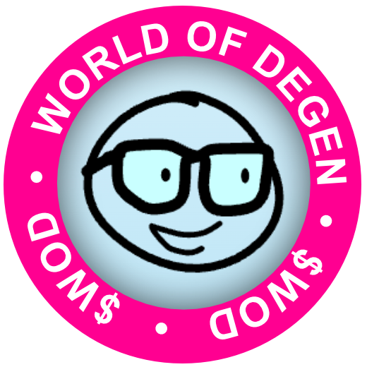

# World of Degens CTO


This code is a Next.js app that generates a random character for each holder of a given SPL minting program and displays them on a plane.

There is one backend API to fectch holder. The rest of the logic in the app is client side. Mostly the CharacterPlane component

## Getting Started

First, copy the .env.example file to a .env file with updated keys:

Then run the development server:

```bash
npm run dev
# or
yarn dev
# or
pnpm dev
# or
bun dev
```

Open [http://localhost:3000](http://localhost:3000) with your browser to see the result.


## Deploy on Vercel

The easiest way to deploy your Next.js app is to use the [Vercel Platform](https://vercel.com/new?utm_medium=default-template&filter=next.js&utm_source=create-next-app&utm_campaign=create-next-app-readme) from the creators of Next.js.

Check out our [Next.js deployment documentation](https://nextjs.org/docs/app/building-your-application/deploying) for more details.

## Donations

If the code is useful for your memecoin, please consider airdropping us some of your token at the original dev address:
7oUZgKUiQUX1XHvsZ8HHs7KEZW1cFSGKpxqYxE3qLKZe

